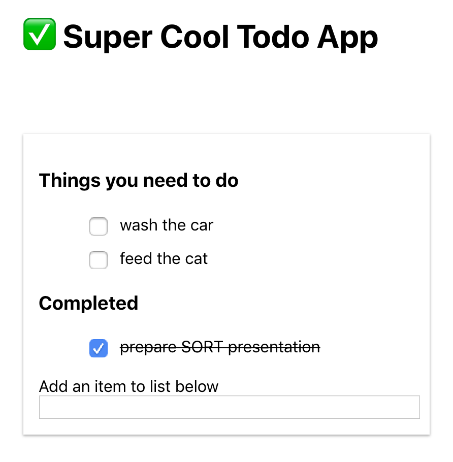

# React Example: Todo App

This is the Quick Start version of this example app. Styling, and other major parts are already completed for you. There are 5 `TODO`s in the code for you to complete as an exercise. You only need to work in the following files:

- `/src/components/TodoItem/index.js`
- `/src/components/TodoList/index.js`

Remember to keep state management in the `TodoList` element. Good luck. Hit me up on Twitter ([@Kyl3W3st](https://twitter.com/Kyl3W3st)) if you have any questions.

You are making the app below:

Look at the `master` branch for the completed version.

